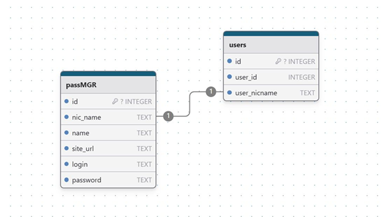
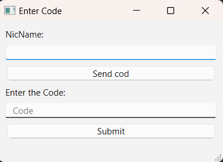
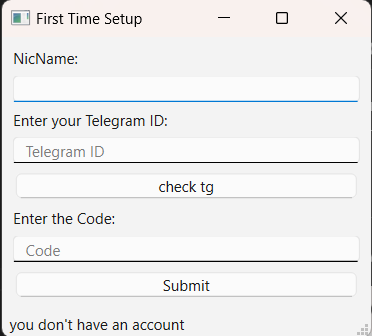
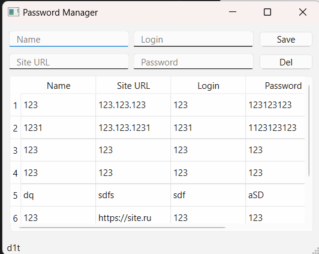

# Password Manager for YandexIyceum

**Password Manager** — это локальный менеджер паролей, созданный на основе **PyQt6**. Программа предназначена для хранения паролей на устройстве пользователя, поддерживает многопользовательский режим и двухфакторную аутентификацию (2FA) через Telegram.  

## 📋 Особенности  
- **Многопользовательский режим**: Реализован с использованием связанных таблиц в базе данных SQLite (см. схему ниже).  
- **Двухфакторная аутентификация (2FA)**: Работает через Telegram с использованием одностороннего вызова функций через `requests`.  
- **Локальное хранение данных**: Все пароли хранятся на устройстве пользователя.  


 

## 🚀 Технологический стек  
- **PyQt6** — интерфейс пользователя  
- **SQLite** — база данных  
- **Requests** — интеграция с Telegram API  
- **Python** — основной язык программирования  

## 🛠️ Установка  
Приложение можно использовать двумя способами:  

1. **Без установки зависимостей**:  
   - Просто скачайте и запустите скомпилированный `.exe` файл.  

2. **Через код**:  
   - Установите Python 3.8+ с официального сайта.  
   - Установите зависимости:  
     ```bash
     pip install -r requirements.txt
     ```  
   - Запустите программу:  
     ```bash
     python main.py
     ```  

## 📖 Использование  
- **Добавление паролей**:  
  Пароли добавляются через текстовое поле (QTextEdit) и кнопку (QPushButton).  
- **Настройка 2FA**:  
  Для настройки двухфакторной аутентификации достаточно ввести ваш Telegram User ID. Остальная настройка происходит автоматически.  

## 🔒 Безопасность  
- Данные паролей защищены за счет их локального хранения.  
- Для подтверждения входа используется 2FA.  

## 📷 Скриншоты  
окно для аунтификации уже зарагестрированных пользователей 



окно для регистрации пользователей



основное окно с паролями 


